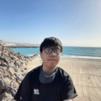

I am a PhD student at [University of Southern California](https://usc.edu). Before joining USC, I was a research assistant in light pollution at [The University of Hong Kong](https://nightsky.physics.hku.hk/). My research interests include remote sensing, machine learning, and environment & sustainability. I develop advanced AI methods for processing Earth Observation data (AI4EO) and apply EO data for sustainability research. 

[Résumé/CV](skrisliuCV.pdf)

[Romanization of Chinese Names](img/name.png)
